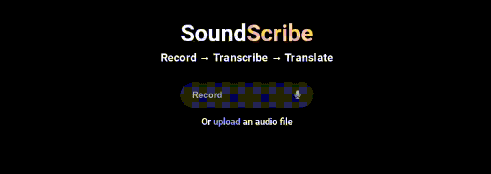

<h1 align="center">
    SoundScribe
</h1>

A powerful web application that leverages React and a pre-trained model for automatic speech recognition and translation. This app allows users to record audio directly in their browser, transcribe the speech into text, and translate the transcription into multiple languages.  
You can view the deployed build at <a href="https://acelowder-transcription.netlify.app/">https://acelowder-transcription.netlify.app/</a> or by clicking the image below.

&nbsp;

## Future Plans

If I have time to come back to this project, I plan to add the following features:

- **Refactor Hooks**: Refactor use effects and props into hooks and context providers.
- **Translation Loading**: Create an animation while generating the translation that provides more information.
- **Real-Time Transcription**: Allow the user to generate transcriptions as they speak into thire microphone.

&nbsp;

## Reflections

This project is a single page web app that changes functionality as the user interacts with it. In retrospect, the project may have benefitted from using the react router instead of conditional components, although I am proud of the animations that are currently in the project.
